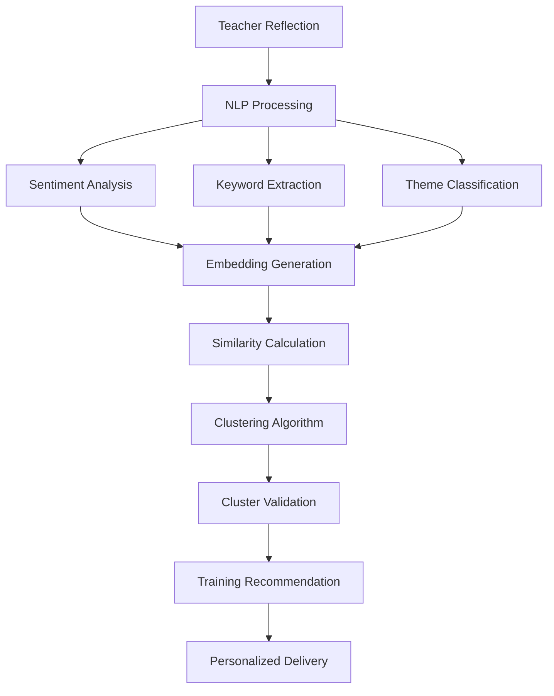

# Guru Vaani - AI-Powered Features Documentation

## Overview

Guru Vaani leverages artificial intelligence to transform teacher reflection data into actionable insights and personalized professional development recommendations. The AI system operates on multiple levels to support both individual teachers and educational administrators.

## Core AI Components

### 1. Natural Language Processing (NLP) Engine

**Purpose**: Analyze teacher reflection entries to extract meaningful insights

**Capabilities**:
- **Sentiment Analysis**: Detects emotional tone (-1 to +1 scale)
  - Positive: Confidence, success, satisfaction
  - Neutral: Factual reporting, observations
  - Negative: Frustration, challenges, stress indicators

- **Keyword Extraction**: Identifies educational concepts and themes
  - Subject-specific terms (division, fractions, photosynthesis)
  - Pedagogical concepts (engagement, assessment, differentiation)
  - Classroom management terms (behavior, attention, discipline)

- **Theme Classification**: Categorizes entries into educational domains
  - Math Concepts, Science Inquiry, Language Arts
  - Classroom Management, Student Engagement
  - Assessment Methods, Parent Communication

- **Urgency Detection**: Flags entries requiring immediate attention
  - Keywords: "urgent", "crisis", "exam tomorrow", "principal meeting"
  - Burnout indicators: "exhausted", "overwhelmed", "quit"
  - Critical mass: Multiple teachers reporting same issue

**Technical Implementation**:
```typescript
interface AIAnalysisResult {
  sentiment: number;           // -1 (negative) to +1 (positive)
  keywords: string[];          // Extracted educational terms
  themes: string[];           // Categorized topics
  urgencyIndicators: string[]; // Crisis/urgent keywords
  embedding: number[];        // 128-dimensional vector
  confidence: number;         // Analysis confidence (0-1)
}
```

### 2. Intelligent Clustering System

**Purpose**: Group similar teacher challenges to identify systemic issues

**Algorithm**: Semantic similarity clustering using:
- **Vector Embeddings**: Convert text to numerical representations
- **DBSCAN Clustering**: Density-based clustering for flexible cluster shapes
- **Hierarchical Clustering**: Create topic hierarchies and sub-themes

**Clustering Process**:
1. **Preprocessing**: Clean and tokenize reflection text
2. **Embedding Generation**: Create vector representations using:
   - Pre-trained models (DistilBERT, Sentence-BERT)
   - Domain-specific fine-tuning on educational content
3. **Similarity Calculation**: Cosine similarity between embeddings
4. **Cluster Formation**: Group reflections with >70% similarity
5. **Cluster Validation**: Ensure minimum cluster size (3+ teachers)

**Cluster Metadata**:
```typescript
interface AICluster {
  id: string;
  title: string;              // AI-generated descriptive title
  teacherCount: number;       // Number of affected teachers
  priority: ClusterPriority;  // LOW | MEDIUM | HIGH | CRITICAL
  keywords: string[];         // Common themes across cluster
  confidence: number;         // Clustering confidence score
  trend: 'growing' | 'stable' | 'declining';
  suggestedTraining: string;  // Recommended intervention
  relevanceScore: number;     // Training-cluster match score
}
```

**Priority Determination**:
- **CRITICAL**: 20+ teachers OR average sentiment < -0.5
- **HIGH**: 10+ teachers OR average sentiment < -0.2
- **MEDIUM**: 5+ teachers with moderate concerns
- **LOW**: Small groups with minor issues

### 3. Personalized Recommendation Engine

**Purpose**: Match teachers with relevant training modules based on their challenges

**Recommendation Algorithm**:
1. **Content Analysis**: Analyze reflection content and context
2. **Profile Matching**: Consider teacher's subject, grade, experience
3. **Collaborative Filtering**: "Teachers like you also benefited from..."
4. **Content-Based Filtering**: Match keywords and themes
5. **Quality Weighting**: Factor in module ratings and completion rates

**Relevance Scoring**:
```typescript
function calculateRelevanceScore(context: TeacherContext, module: TrainingModule): number {
  let score = 0;
  
  // Subject match (40% weight)
  if (context.subject === module.subject) score += 0.4;
  
  // Grade level match (30% weight)
  if (context.grades.includes(module.grade)) score += 0.3;
  
  // Keyword overlap (20% weight)
  const keywordMatch = intersection(context.keywords, module.topics).length;
  score += (keywordMatch / context.keywords.length) * 0.2;
  
  // Quality factors (10% weight)
  score += (module.avgRating / 5) * 0.05;
  score += (module.completionRate / 100) * 0.05;
  
  return Math.min(1, score);
}
```

**Recommendation Types**:
- **Immediate**: Based on current reflection content
- **Proactive**: Predicted needs based on teaching context
- **Remedial**: Follow-up training for unresolved issues
- **Advanced**: Next-level skills for successful teachers

### 4. Predictive Analytics

**Purpose**: Forecast trends and prevent issues before they escalate

**Prediction Models**:
- **Issue Escalation**: Predict which challenges will spread
- **Teacher Burnout**: Early warning system for stress indicators
- **Training Effectiveness**: Predict module success rates
- **Seasonal Patterns**: Anticipate recurring challenges (exam periods, new academic year)

**Early Warning System**:
```typescript
interface UrgentIssue {
  type: 'burnout' | 'systematic' | 'critical_mass';
  description: string;
  affectedTeachers: number;
  recommendedAction: string;
  priority: 'HIGH' | 'CRITICAL';
  timeline: string; // "Immediate", "Within 48 hours"
}
```

**Burnout Detection Indicators**:
- Frequency: Increased negative sentiment over time
- Keywords: "tired", "overwhelmed", "stressed", "quit"
- Behavioral: Decreased engagement, shorter entries
- Temporal: Consistent negative patterns across weeks

## AI-Powered User Experiences

### For Teachers (Mobile App)

#### 1. Smart Entry Assistance
- **Real-time Suggestions**: As teachers type, show similar challenges from peers
- **Voice Transcription**: Convert speech to text with educational vocabulary optimization
- **Auto-tagging**: Suggest relevant tags based on content analysis
- **Completion Prompts**: Guide teachers to provide comprehensive reflections

#### 2. Personalized Learning Paths
- **Adaptive Recommendations**: Training modules tailored to individual challenges
- **Progress Tracking**: Monitor skill development and challenge resolution
- **Micro-learning**: Bite-sized content (3-10 minutes) for busy schedules
- **Offline Sync**: Download recommended content for low-connectivity areas

#### 3. Peer Learning Network
- **Anonymous Sharing**: Connect with teachers facing similar challenges
- **Success Stories**: Highlight effective solutions from peer community
- **Collaborative Problem-Solving**: Group discussions around common themes

### For Administrators (Web Dashboard)

#### 1. Intelligent Analytics Dashboard
- **Real-time Clustering**: Live visualization of emerging teacher challenges
- **Trend Analysis**: Historical patterns and seasonal variations
- **Geographic Insights**: Block/district-wise challenge mapping
- **Predictive Alerts**: Early warning for systematic issues

#### 2. Targeted Intervention Tools
- **Smart Dispatching**: Send relevant training to specific teacher groups
- **Resource Allocation**: Data-driven decisions on training priorities
- **Impact Measurement**: Before/after analysis of interventions
- **ROI Tracking**: Measure effectiveness of professional development investments

#### 3. Content Management AI
- **Auto-curation**: Suggest training modules for specific clusters
- **Quality Assessment**: Analyze module effectiveness and user feedback
- **Content Gaps**: Identify missing training topics based on teacher needs
- **Translation Assistance**: AI-powered localization for regional languages

## Technical Architecture

### AI Pipeline Flow



### Data Flow Architecture

```typescript
// Reflection Processing Pipeline
class AIProcessingPipeline {
  async processReflection(reflection: Reflection): Promise<ProcessingResult> {
    // 1. NLP Analysis
    const analysis = await this.nlpService.analyze(reflection.content);
    
    // 2. Store Analytics
    await this.storeAnalytics(reflection.id, analysis);
    
    // 3. Update Clusters
    const clusters = await this.clusteringService.updateClusters(reflection);
    
    // 4. Generate Recommendations
    const recommendations = await this.recommendationService.generate(
      reflection, 
      analysis, 
      clusters
    );
    
    // 5. Trigger Notifications
    await this.notificationService.sendRecommendations(
      reflection.authorId, 
      recommendations
    );
    
    return { analysis, clusters, recommendations };
  }
}
```

### Model Integration Points

#### 1. Hugging Face Transformers
```python
# Sentiment Analysis Model
from transformers import pipeline

sentiment_analyzer = pipeline(
    "sentiment-analysis",
    model="cardiffnlp/twitter-roberta-base-sentiment-latest"
)

# Educational Domain Fine-tuning
from transformers import AutoTokenizer, AutoModelForSequenceClassification

tokenizer = AutoTokenizer.from_pretrained("distilbert-base-uncased")
model = AutoModelForSequenceClassification.from_pretrained(
    "./models/education-sentiment-model"  # Custom trained model
)
```

#### 2. Clustering Implementation
```python
# Semantic Clustering with DBSCAN
from sklearn.cluster import DBSCAN
from sentence_transformers import SentenceTransformer

# Generate embeddings
model = SentenceTransformer('all-MiniLM-L6-v2')
embeddings = model.encode(reflection_texts)

# Perform clustering
clustering = DBSCAN(eps=0.3, min_samples=3).fit(embeddings)
cluster_labels = clustering.labels_
```

### Performance Optimization

#### 1. Caching Strategy
- **Embedding Cache**: Store computed embeddings for reuse
- **Cluster Cache**: Cache cluster results for 24 hours
- **Recommendation Cache**: Personal recommendations valid for 7 days

#### 2. Batch Processing
- **Nightly Clustering**: Run intensive clustering during off-peak hours
- **Incremental Updates**: Process new reflections in real-time
- **Scheduled Analytics**: Generate reports and insights on schedule

#### 3. Scalability Considerations
- **Microservices**: Separate AI services for independent scaling
- **Queue Management**: Use Redis/RabbitMQ for processing queues
- **Load Balancing**: Distribute AI workload across multiple instances

## Privacy and Ethics

### Data Protection
- **Anonymization**: Remove personally identifiable information
- **Encryption**: Encrypt all reflection content and analytics
- **Access Control**: Role-based access to sensitive AI insights
- **Audit Trails**: Log all AI processing and administrative actions

### Bias Mitigation
- **Diverse Training Data**: Include reflections from various contexts
- **Regular Audits**: Monitor AI outputs for bias patterns
- **Human Oversight**: Admin review of AI-generated clusters and recommendations
- **Feedback Loops**: Incorporate teacher feedback to improve accuracy

### Transparency
- **Explainable AI**: Provide reasoning for recommendations
- **Confidence Scores**: Show AI confidence levels to users
- **Opt-out Options**: Allow teachers to disable AI features
- **Data Usage Clarity**: Clear communication about how data is used

## Deployment and Monitoring

### Model Deployment
```yaml
# Docker configuration for AI services
version: '3.8'
services:
  ai-service:
    image: guru-vaani/ai-service:latest
    environment:
      - MODEL_PATH=/models
      - REDIS_URL=redis://redis:6379
      - POSTGRES_URL=postgresql://db:5432/guru_vaani
    volumes:
      - ./models:/models
    depends_on:
      - redis
      - postgres
```

### Monitoring and Alerting
- **Model Performance**: Track accuracy, precision, recall metrics
- **Processing Latency**: Monitor AI response times
- **Error Rates**: Alert on processing failures
- **Resource Usage**: Monitor CPU, memory, GPU utilization
- **Data Quality**: Validate input data and flag anomalies

### Continuous Improvement
- **A/B Testing**: Test new models and algorithms
- **Feedback Integration**: Incorporate user feedback into model training
- **Regular Retraining**: Update models with new data
- **Performance Benchmarking**: Compare against baseline metrics

## Future Enhancements

### Advanced AI Features
1. **Multimodal Analysis**: Process images and audio from classroom observations
2. **Predictive Modeling**: Forecast student outcomes based on teacher reflections
3. **Automated Content Creation**: Generate training modules based on identified gaps
4. **Real-time Coaching**: Provide immediate feedback during reflection entry

### Integration Opportunities
1. **Learning Management Systems**: Connect with existing educational platforms
2. **Student Information Systems**: Correlate teacher challenges with student data
3. **Professional Development Platforms**: Integrate with DIKSHA, SWAYAM
4. **Assessment Tools**: Link reflections to student assessment results

This AI-powered approach transforms Guru Vaani from a simple reflection tool into an intelligent professional development ecosystem that learns, adapts, and grows with the teaching community.